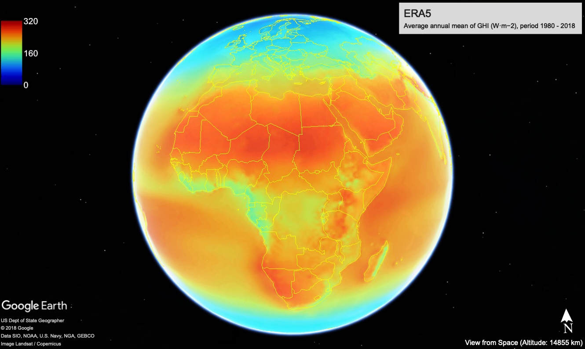

```{r setup, include=FALSE}
knitr::opts_chunk$set(echo = TRUE)
```


```{r nume figuri,echo=FALSE}
library(captioner)

table_nums <- captioner(prefix = "Table", levels = 1)
rad.meta <- table_nums("rad.meta","Metadata of the selected radiometric stations") 
kg.ind <- table_nums("kg.ind","Summary of the validation results by KÖPPEN-GEIGER climate classification zones") 
seas.ind <- table_nums("seas.ind","Summary of the validation results by seasons and hemispheres") 
sum.ind <- table_nums("sum.ind","Summary statistic for ERA5 estimates and BSRN measurements")


fig_nums <- captioner(prefix = "Figure", levels = 1)
rad.net <- fig_nums("rad.net", "Selected radiometric staions")
rad.bwplot <- fig_nums("rad.bwplot", "Box-and-whisker plots of the daily GHI (W/m²) obtained from BSRN archives (2006-2015). The filled dots denote the median, solid boxes range from the lower to the upper quartile, and dashed whiskers show the data range. Data that are further than 1.5 times the interquartile range from the nearest quartile are shown as open bullets. The stations are ordered by latitude and altitude.")
rad.matrix <- fig_nums("rad.matrix", "Matrix of scatterplots between reference dataset and the model's estimates (W/m²) for all the stations and climate zones")
plot.trends <- fig_nums("plot.trends", "Trends in seasonal GHI. Gray-shaded areas in the plots highlight the grid cells presenting significant decreasing or increasing trends at 95% level (two tailed).")
plot.anomalies <- fig_nums("plot.anomalies", "Seasonal and annual mean anomaly time series of ERA5 GHI ($W·m^{-2}$)" )
seas.mean1 <- fig_nums("seas.mean1", "Average seasonal mean of GHI ($W·m^{-2}$), period 1980 - 2018" )
seas.mean2 <- fig_nums("seas.mean2", "Average seasonal mean of GHI ($W·m^{-2}$), period 2009 - 2018" )
annual.mean <- fig_nums("annual.mean", "Average annual mean of GHI ($W·m^{-2}$), period 1980 - 2018 and 2009 - 2018" )
seas.meange <- fig_nums("seas.meange", "Average seasonal mean of GHI ($W·m^{-2}$), period 2009 - 2018 (from KML file)" )
```

## Introduction

The objective of this work is to demonstrate if the ERA5 reanalysis could be used to provide valuable meteorological information (surface solar radiation) for the areas around the globe, in situations when ground-based measurements are not available. 

 The accuracy of the solar radiation information available from ERA5 was assessed using observations of the best possible quality for shortwave surface radiation fluxes (BSRN network). The main outcomes consist of delivering the worldwide solar radiation resource maps, at annual and seasonal scale, at a reasonable spatial resolution (0.28º).

The variability and trend analysis were performed to identify how stable is the amount of surface solar radiation and how solar radiation varies over the past decades.

The project is available at the following repository https://github.com/alexdum/foss4g, and is structured as follows:

- _M_ folder containing the RMarkdown source code and HTML and DOCX files converted from Rmd file (era5_radiation.docx, era5_radiation.html are the documents);
- _RDate_ folder where R objects are stored;
- _tabs_ folder which contain metadata of the stations and the solar global radiation data extracted from ERA5 model and BSRN network;
- _sh_ folder with the ksh scripts run on the ecgate cluster;
- _R_ folder with R language scripts;
- _kml_ final maps available in KML file format;
- _geotiff_ GeoTIFF files with the raster in WGS84 projectiion, at the native ERA5 sptial resolution.

All the R code available in the _M/era5_radiation.Rmd_ document is fully reproducible, with the condition that the project's folders structure should be the same as the one on project's github repository (https://github.com/alexdum/foss4g). The repository must be cloned locally. The CDO code is not fully reproducible due to the large size of the files processed which can not be made available through the GitHub repository.

This report was generated in HTML and DOCX format (see: https://github.com/alexdum/foss4g/tree/master/M) with the open-source application RMarkdown (https://rmarkdown.rstudio.com/), which provides an environment for creating data science documents that are fully reproducible using multiple programming languages (R, Python, SQL). This document contains also the source code used for obtaining the results. The results are either images or graphs, that are displayed in the report, or files that are saved in the project's folders structure. 

## Input dataset

- ERA5 global horizontal irradiance (GHI) estimates are used as the main dataset in this work;

- The reference dataset will consist of solar radiation measurements obtained from the Baseline Surface Radiation Network (BSRN - https://bsrn.awi.de/).


### Baseline Surface Radiation Network

- consist of 24 radiometric selected stations located in in contrasting climatic zones;
- the stations provide solarradiation and atmospheric measurments;
- equipped with instruments of the highest available accuracy and with high time resolution;
- the BSRN datasets were retrieved via PANGAEA portal (https://bsrn.awi.de/data/data-retrieval-via-pangaea/);
- selected hourly data from the stations that have observations available between 2006 to 2015 (Figure `r fig_nums("rad.net", display = "num")`, Table `r table_nums("rad.meta", display = "num")`);
- we considered only the days which have at least 90% of available radiation data for each day.

The sub-hourly global horizontal irradiance (GHI) raw values were averaged to daily values, after they were quality checked using the algorithm Solarpos without refraction as implemented in BSRN Toolbox [@schmithusen2012bsrn].

```{r radiometric, echo=TRUE, fig.cap=rad.net}
library(mapview)
library(sp)
library(knitr)
rad.network <- read.table("../tabs/rad_network.csv", sep = ";", header = T)
kable(rad.network, caption = rad.meta)
coordinates(rad.network) <- ~longitude + latitude
proj4string(rad.network) <- "+init=epsg:4326"
mapview(rad.network, layer.name = 'Radiometric network used in the study')
```


```{r bwplot, echo=TRUE, fig.cap=rad.bwplot}
library(lattice)
tab <- read.table("../tabs/rad_network.csv", sep = ";", header = T)
tab <- tab[order(tab$latitude, tab$elevation),]
tabf <- NULL
for (i in 1:nrow(tab)) {
  
  tab.i <- read.csv(paste0("../tabs/daily_bsrn/", tab$id[i],"_2006_2015.csv"))
  tab.i$id <- tab$id[i]
  tabf <- rbind(tabf, tab.i)
}

tabf$id <- factor(tabf$id, levels = unique(tabf$id))

bwplot(id~ghi, data = tabf, xlab = "GHI (W/m^2)",col = "red",
       par.settings = list(box.rectangle = list(col = "salmon",fill = "salmon",alpha = 0.4),
                           box.umbrella = list(col = "salmon",alpha = 0.4),
                           plot.symbol = list(col = "salmon",alpha = 0.4, pch = 20)))
```


### ERA5 dataset

- the latest global reanalysis product, produced by ECMWF;
- provide hourly meteorological data from 1979 onwards;
- spatial resolution approximate 30 km grid;
- open access and free to download for all uses, including commercial use through the C3S Climate Data Store (https://cds.climate.copernicus.eu);
- more info: https://climate.copernicus.eu/climate-reanalysis;
- the variable used is the surface solar radiation downwards, which is part of the forecast fields;
- two subset used:
    - for validation: hourly data obtained directly from the ECMWF Meteorological Archival and Retrieval System (MARS), via ecgate cluster (2006-2015) (294.89 GB on disk);
    - for climate trend and variability analysis and solar resource mapping: monthly data from C3S Climate Data Store (1980-2018) (1.96 GB on disk).

Due to a large amount of data necessary to be processed at the validation stage, hourly ERA5 data was extracted for the years 2006 to 2015 via ecgate cluster (https://www.ecmwf.int/en/computing/our-facilities/ecgate) by using a retrieve script generated from the links available on the Mars Catalogue (https://apps.ecmwf.int/mars-catalogue/):
```console
#!/bin/ksh -x
#SBATCH --qos=normal
#SBATCH --job-name=get_era5
#SBATCH --output=/home/ms/ro/roq/scripts/era5/logs/get_era5%N.%j.out
#SBATCH --error=/home/ms/ro/roq/scripts/era5/logs/get_era5%N.%j.out
#SBATCH --workdir=/scratch/ms/ro/roq/radiation
#SBATCH --time=23:30:00

export PATH=$PATH:.             
set -xv
cd $SCRATCH/radiation

f_marsReq=marsreq.tmp
f_logMars=marsreq.log

cat >${f_marsReq} <<EOF
retrieve,
class=ea,
date=2005-12-30/to/2016-01-01,
expver=1,
levtype=sfc,
param=169.128,
stream=oper,
time=06:00:00/18:00:00,
type=fc,
step=1/2/3/4/5/6/7/8/9/10/11/12,
grid=0.28125/0.28125,
target="ghi.grb"
EOF
#-- Perform MARS request in one go
export MARS_MULTITARGET_STRICT_FORMAT=1
mars < ${f_marsReq} > ${f_logMars}
```
The hourly data was agggregated to daily data and save as NetCDF file using the Climate Data Operators (CDO - https://www.mpimet.mpg.de/cdo/) tool [@kaspar2010climate]. CDO was developed at the Max-Planck-Institute for Meteorology. It is open source and released under the terms of the GNU General Public License v2 (GPL). The source code is available at
https://code.zmaw.de/projects/cdo. 

The computation was performed on the same ecgate cluster. 


```console
#!/bin/ksh -x
#SBATCH --qos=normal
#SBATCH --job-name=ghi_daily
#SBATCH --output=/home/ms/ro/roq/scripts/era5/logs/to_ghi_daily%N.%j.out
#SBATCH --error=/home/ms/ro/roq/scripts/era5/logs/to_ghi_daily%N.%j.out
#SBATCH --workdir=/scratch/ms/ro/roq/radiation
#SBATCH --time=23:30:00

export PATH=$PATH:.             
set -xv

cd $SCRATCH/radiation

module load cdo
cdo setgridtype,regular ghi.grb  output_ghi.grb
cdo -f nc -t ecmwf setgridtype,regular output_ghi.grb output_ghi.nc
rm output_ghi.grb
cdo shifttime,-1hour output_ghi.nc ghi_shift1h.nc
rm output_ghi.nc
cdo daymean ghi_shift1h.nc ghi_daily.nc
rm ghi_shift1h.nc
```
The functions implemented in the CDO tool were used to iteratively extract the daily radiation data at each radiometric station location. The example below shows how the radiation data was obtained from ERA5 at Carpentras radiometric station coordinates:

```console
cdo -outputtab,lon,lat,date,time,value -remapnn,lon=5.05900_lat=44.08300 /scratch/ms/ro/roq/radiation/output_ghi.nc > CAR_ERA5.txt
```
## Validation of ERA5 data

The comparison between ERA5 data and reference (BSRN network) dataset was performed for the entire dataset, as well as for the subsets of data by seasons and Köppen-Geiger climate classes, using the well-known indicators of accuracy (bias, root mean squared error, root relative squared error), matrix of scatterplots, the summary statistics (mean, standard deviation, range, etc.). Existing R language tools (e.g. libraries Metrics, openair, etc) were used in analyzing the accuracy of the reanalysis product. R is a programming language and free software environment for statistical computing and graphics supported by the R Foundation for Statistical Computing [@rlanguage].

For all the stations, the Köppen-Geiger climate classification metadata was obtained from a high spatial resolution map of 5 arc minutes, representative for the 25-year, period 1986-2010 [@rubel2017climate].

The two data sets were merged by using _merge()_ function from the R base package, by using field _dates_ as common columns. In order to preserve data structures (columns data types), the new dataset was saved as compressed R object:

```{r rmerge, echo=TRUE}
tab <- read.table("../tabs/rad_network.csv", sep = ";", header = T)

tabf <- NULL
for (i in 1:nrow(tab)) {
  
  era5 <- read.csv(paste0("../tabs/daily_era5/", tab$id[i], "_2006_2015.csv"))
  era5$date <- as.Date(era5$date)
  
  bsrn <- read.csv(paste0("../tabs/daily_bsrn/", tab$id[i], "_2006_2015.csv"))
  bsrn$date <- as.Date(as.character(bsrn$date), format = "%Y%m%d")
  
  tab.i <- merge(era5, bsrn, by.x.y = "date")
  names(tab.i)[3] <- "bsrn_ghi"
  # add id of each station
  tab.i$id <- tab$id[i]
  # add koppen geiger class and code
  tab.i$kg_class <- tab$kg_class[i]
  tab.i$kg_code <- tab$kg_code[i]
  # add hemisphere
  tab.i$hemisphere <- ifelse(tab$latitude[i] > 0, "Northern", "Southern")
  
  
  tabf <- rbind(tabf, tab.i)
}

saveRDS(tabf, file = "../RData/ghi_bsrn_era5.rds")
```

First, the mean bias error (MBE), mean absolute error (MAE), and the root relative squared error (RRSE) were used as performance statistics indicators for the ERA5 estimates. The metrics were computed with the functions implemented in R __Metrics__ library [@hamner2018metrics].

<!-- $$ -->
<!-- MBE=\frac{1}{N}\sum_{i=1}^N (Os_{i}-Ps_{i}) -->
<!-- $$ -->

<!-- $$ -->
<!-- MAE=\frac{1}{N}\sum_{i=1}^N |(Os_{i}-Ps_{i})| -->
<!-- $$ -->
<!-- $$ -->
<!-- RMSE=\begin{pmatrix}\frac{1}{N}\sum_{i=1}^N (Os_{i}-Ps_{i})^2\end{pmatrix}^\frac{1}{2} -->
<!-- $$ -->

The indicators were computed for all the station by Köppen-Geiger climate classification zones and by seasons. The performance metrics of the reanalysis products are summarized in  Table `r table_nums("kg.ind", display = "num")` and  Table `r table_nums("seas.ind", display = "num")`. Overall, the estimates reported by ERA5 agree with data obtained from BSRN stations. As regarding these indicators, we can notice that the model performed best for BW climate zones, and worst for the tropical climate zones. As concerning the performance of the model by season, there are some significant differences between cold and warm seasons, in the southern hemisphere. The summary statistics computed for both datasets reveal us that generally, ERA5 model tends to underestimate the extreme values as well as the variability of the analyzed parameter, regardless of the climate zone (Table `r table_nums("sum.ind", display = "num")`). 

By looking at the scatterplots and R-squared (Figure `r fig_nums("rad.matrix", display = "num")`), some differences between the climate zones may be observed, but the agreement between the two analyzed datasets is quite reasonable. The matrix of scatterplots was constructed with the help of the _scatterPlot()_ function form the __openair__ R package [@carslaw2012openair].

```{r indicators, echo=TRUE, fig.cap=rad.matrix, fig.height=6, fig.width=10}
library(seas, quietly = T)
library(Metrics, quietly = T)
library(dplyr, quietly = T, warn.conflicts = F)
library(knitr, quietly = T)
library(moments)
library(openair)

# read ERA5 and BSRN date
tab <- readRDS("../RData/ghi_bsrn_era5.rds")


# extract KG main climate groups
tab$KG <- substr(tab$kg_class, 1,2)

# compute seasons
tab$season <-  mkseas(x = tab, width = "DJF")


# compute indiccators by kg classes
indicators.kg <- tab %>% group_by(KG) %>% 
  summarise(ME = round(bias(bsrn_ghi, era5_ghi), 3), 
            MAE = round(mae(bsrn_ghi, era5_ghi), 3),
            RRSE = round(rrse(bsrn_ghi, era5_ghi), 3))

# transpose table
ti.kg <- t(indicators.kg[,2:4])
colnames(ti.kg) <- indicators.kg$KG

kable(ti.kg ,caption = kg.ind)

# compute indicators by seasons and hemisphere
indicators.seas <- tab %>% group_by(season, hemisphere) %>% 
  summarise(ME = round(bias(bsrn_ghi, era5_ghi), 3), 
            MAE = round(mae(bsrn_ghi, era5_ghi), 3),
            RRSE = round(rrse(bsrn_ghi, era5_ghi), 3))

# transpose table
ti.seas <- t(indicators.seas[,2:5])
colnames(ti.seas) <- indicators.seas$season

kable(ti.seas,caption = seas.ind)


# compute summary statistics by KG classes
tab1 <- data.frame(tab[,c(1,2,4,5,6,7,8)], source = "ERA5")
names(tab1)[2] <- "GHI"
tab2 <- data.frame(tab[,c(1,3,4,5,6,7,8)], source = "BSRN")
names(tab2)[2] <- "GHI"
tabs <- rbind(tab1, tab2)


stats <- tabs %>%  group_by(KG, source) %>% summarise(Mean = mean(GHI), Median = median(GHI), Sd = sd(GHI),Cv = (sd(GHI)/mean(GHI)) * 100, Max = max(GHI), Skewness = skewness(GHI), Kurtosis = kurtosis(GHI))
# round values
stats[,3:8] <- round(stats[,3:8], 3)   
kable(stats, caption = sum.ind)


scatterPlot(tab, y = "era5_ghi", x = "bsrn_ghi", type = "KG", xlab = "BSRN GHI [W/m²]", ylab = "ERA5 GHI [W/m²]", linear = T, smooth = F)
```


## Variability and trend analysis

The main data set used at this stage is ERA5 monthly GHI averaged data on single levels from 1979 to present, obtained from the Copernicus Climate Data Store (https://cds.climate.copernicus.eu/cdsapp#!/dataset/reanalysis-era5-single-levels-monthly-means?tab=form). The data was downloaded in GRIB format and converted to NetCDF using the CDO tool. The conversion from GRIB format involved also the transformation from the irregularly spaced latitudes to a regular Gaussian grid with an equal number of longitudes on each latitude row. The longitudes of the global regular grid were shifted from  0 to 360 to the range -180 to 180 degrees, with the help of the _sellonlatbox_ function from the same CDO tool.

```console
cdo -f nc -t ecmwf setgridtype,regular adaptor.mars.internal-1565286172.367593-20556-9-d39c32ec-c74b-451c-97e3-32aab88f4217.grib nc/ghi.nc
cdo sellonlatbox,-180,180,-90,90 nc/ghi.nc nc/ghi_rot_1980_2018.nc
# transform from J/m2 to W/m2
cdo aexpr,"SSRD=SSRD/(3600 * 24)"  nc/ghi_rot_1980_2018.nc  nc/ghi_1980_2018.nc
# shift time axis 6 hours ahead to match correct time
cdo shifttime,6hours nc/ghi_1980_2018.nc nc/ghi_shift_1980_2018.nc
# compute seasonal means
cdo -v seasavg nc/ghi_shift_1980_2018.nc nc/ghi_seasonal_1980_2018.nc
# compute annual means
cdo -v yearmean nc/gghi_shift_1980_2018.nc nc/ghi_annual_1980_2018.nc
```
The nonparametric Mann-Kendall trend test was employed to detect the significance of monotonic trends for each grid cell of the GHI data, between 1980 to 2018 [@kendall1948rank; @mann1945nonparametric]. The  MK  test  is  a  rank-based procedure, especially suitable  for  non-normally distributed  data. The linear trends were computed for each season using the method of Theil and Sen [@thiel1950rank; @sen1968estimates]. The methods mentioned above are implemeted in the R library __EnvStats__, which provides a set of powerful functions for graphical and statistical analyses of environmental data [@EnvStats-book]. The rasters with the trends computed for each season are saved as R objects in the _RData_ directory of the project.

```{r trends, echo=TRUE, cache=T}
library(raster, quietly = T, warn.conflicts = F)
library(EnvStats, quietly = T, warn.conflicts = F)
library(parallel, quietly = T, warn.conflicts = F)
library(ncdf4,quietly = T, warn.conflicts = F )
# function to compute Slope and p values
trend.slope <- function(y) {
  fit <- kendallTrendTest(y ~ 1)
  fit.results <- fit$estimate[2]
  fit.results <- c(fit.results, fit$p.value)
  return(fit.results)
}
# read seasonal means
r <- brick("../nc/ghi_seasons_1981_2018.nc")

mid.seasons <- c("04", "07", "10", "01")

# it takes about 20 min
for (i in 1:length(mid.seasons)) {
  # print(mid.seasons[i])
  # subset for each season
  r.seasons <- r[[which(substr(names(r),7,8) == mid.seasons[i])]]
  
  # compute trend in parallel (10 cores)
  beginCluster(n = 10)
  # system.time(
  ghi.trend.parallel <- clusterR(r.seasons , calc, args = list(fun = trend.slope))
  # )
  endCluster()
  
  names(ghi.trend.parallel) <- c("slope", "p.value")
  
  # write raster brick as R objects
  saveRDS(ghi.trend.parallel, file = paste0("../RData/ghi_trends_",mid.seasons[i], ".rds"))
  #plot(ghi.trend.parallel)
}

```

The maps with the trende were ploted ussing _spplot()_ function from __sp__ R package [@bivand2013]. The world country borders were obtained from the __rnaturalearth__ dataset [@andy2017], which contains free for use in any type of project World borders dataset available at 1:10m, 1:50m, and 1:110 million scales.

The  spatial  distribution  of  the  seasonal significant trends (1981 - 2018) is  presented  figure `r fig_nums("plot.trends", display = "num")` and briefly discussed in the following paragraph. The spatial variability of the trends in the different seasons is quite large.  The positive significantly increased (shades of red color palette) were computed for the Spring and the Summer for Europe, Central Africa, and for some areas in South America and the western part of the USA. Significant GHI decreasing trends (shades of blue color palette) occur all the seasons in the oceanic areas of equatorial belt, as well as in the Arctic Regions. It is also worth noting that accurate estimation of changes of solar radiation across the World may be useful for designing and operating appropriate solar power plants.


```{r plot_trends, echo=TRUE, fig.cap=plot.trends, fig.height=9, fig.width=13, cache=T}
library(raster, quietly = T, warn.conflicts = F)
library(rnaturalearth)
library(RColorBrewer)
library(lattice)

countries <- ne_countries(scale = 110, type = "countries")
countries.line <- as(countries, "SpatialLines")
countries.sp <- list("sp.lines", countries.line, col = "#525252",lwd = 1)

# compute p-values and significance levels
mk.winter <- readRDS("../RData/ghi_trends_01.rds")
p.winter <- mk.winter[[2]]
p.winter[p.winter > .05 | p.winter < -.05] <- NA
p.winter <- rasterToPoints(p.winter, spatial = T)
signif.winter <- list("sp.points", p.winter, col = "#525252",pch = 15, cex = 0.1, alpha = 0.08, which = 1)

mk.spring <- readRDS("../RData/ghi_trends_04.rds")
p.spring <- mk.spring[[2]]
p.spring[p.spring > .05 | p.spring < -.05] <- NA
p.spring <- rasterToPoints(p.spring, spatial = T)
signif.spring <- list("sp.points", p.spring, col = "#525252",pch = 15, cex = 0.1, alpha = 0.08, which = 2)


mk.summer <- readRDS("../RData/ghi_trends_07.rds")
p.summer <- mk.summer[[2]]
p.summer[p.summer > .05 | p.summer < -.05] <- NA
p.summer <- rasterToPoints(p.summer, spatial = T)
signif.summer <- list("sp.points", p.summer, col = "#525252",pch = 15, cex = 0.1, alpha = 0.08, which = 3)

mk.fall <- readRDS("../RData/ghi_trends_10.rds")
p.fall <- mk.fall[[2]]
p.fall[p.fall > .05 | p.fall < -.05] <- NA
p.fall <- rasterToPoints(p.fall, spatial = T)
signif.fall <- list("sp.points", p.fall, col = "#525252",pch = 15, cex = 0.1, alpha = 0.08, which = 4)

signif.lists <- list(signif.winter, signif.spring, signif.summer, signif.winter)

# create raster stack with slopes for all seasons
slopes <- brick(mk.winter[[1]], mk.spring[[1]], mk.summer[[1]], mk.fall[[1]])
names(slopes) <- c("DJF", "JJA", "MAM", "SON")

# # check range of values
# summary(slopes)
brks <- seq(-1.4,1.3, 0.2)
# color pallete from red to blue
bls <- colorRampPalette(brewer.pal(6,"Blues")[1:5])
rds <- colorRampPalette(brewer.pal(6,"YlOrRd")[1:5])
cols <- c(rev(bls(8)), rds(6))

p1 <- spplot(slopes,
             sp.layout = list(countries.sp, signif.fall, signif.summer, signif.spring,signif.winter),
             scales = list(draw = TRUE, cex = 0.8),
             col.regions = cols,cuts = length(brks) - 1,at = brks,
             colorkey = list(height = 0.8,
                             labels = list(
                               at = brks[2:(length(brks) - 1)],
                               labels = round(brks,2)[2:(length(brks) - 1)]
                             ), space = "bottom"),
             par.settings = list(strip.background = list(col = "white")))

print(p1)
```          

The anomaly analysis was performed for a spatial domain covering Europe and its vicinity (the longitude range between -35°E to 60°E and latitude range between 35°N to 72°N). The NetCDF data was subsetted using the _crop_ function from __raster__ R package.

The evolution of the annual and seasonal time series anomalies are shown in the figure `r fig_nums("plot.anomalies", display = "num")`. The anomalies computed after the year 2000 for the Spring and the Summer are positive for almost all the years, which is in agreement with the previous analysis when positive significant trends were detected for the two seasons. The pattern of the annual anomalies confirms the global brightening phenomena which occur at the end of the 80s and which was previously documented from observational data [@wild2009global]. 


```{r plot_anomalies, echo=TRUE, fig.cap=plot.anomalies, fig.height=6, fig.width=8,cache=T}

library(raster, quietly = T, warn.conflicts = F)
library(ncdf4,quietly = T, warn.conflicts = F )
library(ggplot2)


# anual file
r.an <- brick("../nc/ghi_annual_1980_2018.nc")
# crop the data for Europe
# across the longitude range -35°E to 60°E and latitude range 35°N to 72°N
r.ancrop <- crop(r.an, extent(-35,60,35,72))
# compute zonals mean
z.anmean <- cellStats(r.ancrop, stat = mean)
# create data frame (table for ploting)
df.anmean <- data.frame(season = substr(names(z.anmean), 7,8), 
                        date = as.Date(paste0(substr(names(z.anmean), 2,5),"-01-01")),
                        ghi = z.anmean, stringsAsFactors = F)
df.anmean$season <- "Annual"
df.anmean$anom <- df.anmean$ghi - mean(df.anmean$ghi)

# seasonal file
r <- brick("../nc/ghi_seasons_1981_2018.nc")
# crop the data for Europe
r.crop <- crop(r, extent(-35,60,35,72))
# compute zonals mean
z.mean <- cellStats(r.crop, stat = mean)

# create data frame (table for ploting)
df.mean <- data.frame(season = substr(names(z.mean), 7,8), 
                      date = as.Date(paste0(substr(names(z.mean), 2,5),"-01-01")),
                      ghi = z.mean, stringsAsFactors = F)


# rename season
df.mean$season[df.mean$season == "01"] <- "DJF"
df.mean$season[df.mean$season == "04"] <- "MAM"
df.mean$season[df.mean$season == "07"] <- "JJA"
df.mean$season[df.mean$season == "10"] <- "SON"

# comnpute anomalies relative to the mean
df.mean$anom[df.mean$season == "DJF"] <- df.mean$ghi[df.mean$season == "DJF"] - mean(df.mean$ghi[df.mean$season == "DJF"])
df.mean$anom[df.mean$season == "MAM"] <- df.mean$ghi[df.mean$season == "MAM"] - mean(df.mean$ghi[df.mean$season == "MAM"])
df.mean$anom[df.mean$season == "JJA"] <- df.mean$ghi[df.mean$season == "JJA"] - mean(df.mean$ghi[df.mean$season == "JJA"])
df.mean$anom[df.mean$season == "SON"] <- df.mean$ghi[df.mean$season == "SON"] - mean(df.mean$ghi[df.mean$season == "SON"])

# combine the final file for plotting
df.final <- rbind(df.anmean, df.mean)

ggplot(df.final, aes(date, anom, group = season, 
                     color = season)) +
  geom_line(size = 1, alpha = 0.8) +
  geom_point(size = 2) +
  scale_colour_manual(values = c("black","#3182bd", "#800026","#feb24c", "#addd8e")) +
  xlab("Year") +
  ylab(bquote('Anomaly GHI ['*'W ·'~m^-2*']')) +
  theme(legend.title = element_blank())
```

## Solar resource maps generation 

The final maps were obtained by averaging the annual and seasonal data using two periods of reference: 1980-2018 (historical) and 2009-2018 (actual). For plotting the static maps, it was used the same function applied for trends map (_spplot_). _colorRampPalette()_ function was employed to interpolate the 9-class YlOrRd sequential scheme from ColorBrewer application (http://colorbrewer2.org), with light colors assigned for low data values to dark colors for high data values. ColorBrewer is an online tool, also implemented in R environment [@neuwirth2014], designed to help people select good color schemes for maps and other graphics.

The seasonal rasters files were also saved as KML files, and as GeoTIFF files (see folders _kml_ and _geotiff_ from the project). The conversion to KML files was performed with the _plotKML()_ function from the R library with the same name.

The global pattern of GHI spatial distributions does not significantly change over the years (figures `r fig_nums("seas.mean1", display = "num")` and `r fig_nums("seas.mean2", display = "num")`). Seasonal variation are directly influenced by the tilt of the Earth’s axis of rotation, which causes changes in solar radiation received by locations on Earth (maximum GHI values are estimated for the warm seasons).

```{r plot_seasons, echo=TRUE, fig.cap=c(seas.mean1,seas.mean2), fig.height=9, fig.width=13, cache=T}
library(raster, quietly = T, warn.conflicts = F)
library(rnaturalearth)
library(classInt)
library(RColorBrewer)
library(ncdf4)
library(plotKML, quietly = T, warn.conflicts = F)
library(RSAGA, quietly = T, warn.conflicts = F)

# prepare the layer with world borders
countries <- ne_countries(scale = 110, type = "countries")
countries.line <- as(countries, "SpatialLines")
countries.sp <- list("sp.lines", countries.line, col = "#525252",lwd = 1)

# load seasonal data
r.seas <- brick("../nc/ghi_seasons_1981_2018.nc")

# extract season from name
season <- sort(unique(substr(names(r.seas),7,8)))

# compute multianual mean for each season 1980-2018
r.multi <- stack()

for (i in season) { 
  
  r.multi <- addLayer(r.multi, mean(r.seas[[which(substr(names(r.seas),7,8) %in% i)]]))
}

names(r.multi) <- c("DJF","MAM", "JJA", "SON")
r.multi[] <- round(getValues(r.multi), 1)

# # check range of values
# summary(brick(r.multi))
# find the preaks with pretty
brks <- classIntervals(as.vector(getValues(r.multi)), n = 14, style = "pretty")
rds <- colorRampPalette(brewer.pal(9,"YlOrRd"))
cols <- rds(length(brks$brks))

p1 <- spplot(r.multi, sp.layout = list(countries.sp), scales = list(draw = TRUE, cex = 0.8),
             col.regions = cols,cuts = length(brks$brks) - 1,at = brks$brks,
             colorkey = list(height = 0.8,
                             labels = list(
                               at = brks$brks[2:(length(brks$brks) - 1)],
                               labels = round(brks$brks,2)[2:(length(brks$brks) - 1)]
                             ), space = "bottom"),
             par.settings = list(strip.background = list(col = "white")))


# compute multianual mean for each season 2009-2018
##selecct rasters for the period of interest
r.seas2 <- r.seas[[which(substr(names(r.seas),2,5) >= 2009)]]
r.multi2 <- stack()

for (i in season) { 
  
  r.multi2 <- addLayer(r.multi2, mean(r.seas2[[which(substr(names(r.seas2),7,8) %in% i)]]))
}

names(r.multi2) <- c("DJF","MAM", "JJA", "SON")
r.multi2[] <- round(getValues(r.multi2), 1)

# # check range of values
# summary(brick(r.multi))
# find the preaks with pretty
brks <- classIntervals(as.vector(getValues(r.multi2)), n = 14, style = "pretty")
rds <- colorRampPalette(brewer.pal(9,"YlOrRd"))
cols <- rds(length(brks$brks))

p2 <- spplot(r.multi2, sp.layout = list(countries.sp), scales = list(draw = TRUE, cex = 0.8),
             col.regions = cols,cuts = length(brks$brks) - 1,at = brks$brks,
             colorkey = list(height = 0.8,
                             labels = list(
                               at = brks$brks[2:(length(brks$brks) - 1)],
                               labels = round(brks$brks,2)[2:(length(brks$brks) - 1)]
                             ), space = "bottom"),
             par.settings = list(strip.background = list(col = "white")))

plot(p1)
plot(p2)


# write rasters as geotiff files
for (i in 1:nlayers(r.multi2)) {
  writeRaster(r.multi2[[i]], paste0("../geotiff/",names(r.multi2)[i],"_2009_2018.tif"), overwrite = T)
}

for (i in 1:nlayers(r.multi)) {
  writeRaster(r.multi[[i]], paste0("../geotiff/",names(r.multi)[i],"_1980_2018.tif"), overwrite = T)
}
# write kml files
setwd("/Users/alexandrudumitrescu/Documents/clima/2019/foss4g/kml")

for (i in 1:nlayers(r.multi2)) {
  suppressMessages(
    plotKML(r.multi2[[i]], z.lim = c(0,400), colour_scale = SAGA_pal[[1]], alpha = 0.7,
            file.name = paste0(names(r.multi2)[i],"_2009_2018.kml"),
            open.kml = F, obj.summary = F)
  )
}

for (i in 1:nlayers(r.multi)) {
  suppressMessages(
    plotKML(r.multi[[i]], z.lim = c(0,400), colour_scale = SAGA_pal[[1]], alpha = 0.7,
            file.name = paste0(names(r.multi2)[i],"_1980_2018.kml"),
            open.kml = F, obj.summary = F)
  )
}

```


In the same manner were plotted the mean annual rasters for the two periods of interest (1980-2018, 2009-2019). Even at an annual scale, there is just a slight variation regarding the spatial distribution of solar radiation computed for the periods of interest.

The maps were also saved as GeoTIFF and KML files using the same methods and functions applied for the seasonal maps.


```{r plot_annual, echo=TRUE, fig.cap=c(annual.mean), fig.height=10, fig.width=12, cache=T}
library(raster,quietly = T, warn.conflicts = F)
library(rnaturalearth,quietly = T, warn.conflicts = F)
library(classInt,quietly = T, warn.conflicts = F)
library(RColorBrewer,quietly = T, warn.conflicts = F)
library(RSAGA,quietly = T, warn.conflicts = F)
library(plotKML, quietly = T, warn.conflicts = F)

# prepare the layer with world borders
countries <- ne_countries(scale = 110, type = "countries")
countries.line <- as(countries, "SpatialLines")
countries.sp <- list("sp.lines", countries.line, col = "#525252",lwd = 1)

# load sannual data
r.ann <- brick("../nc/ghi_annual_1980_2018.nc")

#average for the all periods
r.p1 <- mean(r.ann)

# compute multianual mean for each season 2009-2018
##selecct rasters for the period of interest
r.p2 <- r.ann[[which(substr(names(r.ann),2,5) >= 2009)]]
r.p2 <- mean(r.p2)

# combine the two files
rf <- brick(r.p1, r.p2)
names(rf) <- c("1980", "2009")
# # check range of values
# summary(brick(r.multi))
# find the preaks with pretty
brks <- classIntervals(as.vector(getValues(r.p2)), n = 14, style = "pretty")
rds <- colorRampPalette(brewer.pal(9,"YlOrRd"))
cols <- rds(length(brks$brks))

p1 <- spplot(rf, sp.layout = list(countries.sp), scales = list(draw = TRUE, cex = 0.8),
             col.regions = cols,cuts = length(brks$brks) - 1,at = brks$brks,
             names.attr = c("1980 - 2018", "2009 - 2018"),
             colorkey = list(height = 0.8,
                             labels = list(
                               at = brks$brks[2:(length(brks$brks) - 1)],
                               labels = round(brks$brks,2)[2:(length(brks$brks) - 1)]
                             ), space = "bottom"),
             par.settings = list(strip.background = list(col = "white")))
plot(p1)


# write rasters as geotiff files
for (i in 1:nlayers(rf)) {
  writeRaster(rf[[i]], paste0("../geotiff/Annual_",gsub("X", "",names(rf)[i]),"_2018.tif"), overwrite = T)
}
# write kml files
setwd("/Users/alexandrudumitrescu/Documents/clima/2019/foss4g/kml")

for (i in 1:nlayers(rf)) {
  suppressMessages(
    plotKML(rf[[i]], z.lim = c(0,320), colour_scale = SAGA_pal[[1]], alpha = 0.7,
            file.name = paste0("Annual_",gsub("X", "",names(rf)[i]),"_2018.kml"),
            open.kml = F)
  )
}

```

The seasonal and annual KML files could be opened in GoogleMaps or using the GgooleEarth application.



## Conclusions

Open source tools and open access data have been used to worldwide map the spatial distribution of the Global Horizontal Irradiance (GHI).

The ERA5 Surface solar radiation downwards hourly and monthly data have been used as the main dataset in this work. The performance of the ERA5 estimations was assessed using solar radiation measurements obtained from the Baseline Surface Radiation Network.

Functions from open-source software tools were employed to process the reanalysis and ground-based observational datasets, to validate the estimations from the model, perform the trend and variability analysis, and to temporally aggregate the NetCDF files and to map the results.

The comparison between the two datasets revealed that ERA5 provides quite reliable estimates. The positive significantly trends were detected for Europe, Central Africa, and some areas in South America and the western part of the USA in the Spring and the Summer. The final solar radiation maps were obtined by temporarly aggregating ERA5 data at seasonal and annual scales. The final products were saved as PNG images (inserted in HTML and DOCX files), as well as stand-alone raster GeoTIFF and KML files format.

In this work, we demonstrate that open-source tools (CDO and R language) provide functionalities to manipulate large files, and perform various tasks to obtain reliable products that can be used for climate change and variability assessment, as well as for climate monitoring. The applications used in this work offer the possibility to easily perform repetitive procedures by using user-written scripts, and to write and use your own functions.

## Bibliography {-}